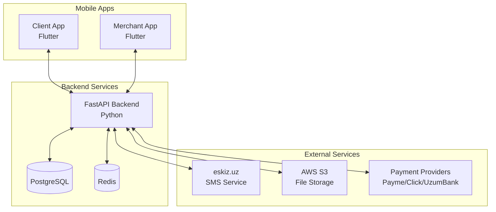

# Wedy - Wedding Services Platform


**Connecting couples with wedding service providers in Uzbekistan**

## 📱 Platform Overview

Wedy is a comprehensive wedding services platform consisting of:

- **Client Mobile App (Flutter)** - For couples to discover and contact wedding services
- **Merchant Mobile App (Flutter)** - For service providers to manage their business
- **Backend API (FastAPI)** - Central system handling all business logic

## 🚀 Quick Start

### Prerequisites

- **Backend**: Python 3.11+, PostgreSQL 15+, Redis 7+
- **Mobile**: Flutter 3.x, Android Studio/Xcode
- **Development**: Docker, Git

### Development Setup

1. **Clone the repository**
```bash
git clone <repository-url>
cd wedy
```

2. **Start development environment**
```bash
# Start PostgreSQL and Redis with Docker
docker-compose up -d

# Or use the setup script
./scripts/setup/dev-setup.sh
```

3. **Backend Setup**
```bash
cd backend
cp .env.example .env
# Edit .env with your configuration

poetry install
poetry run python scripts/init_db.py
poetry run python scripts/seed_data.py
poetry run uvicorn app.main:app --reload
```

4. **Mobile Setup**
```bash
cd mobile
flutter pub get
flutter run --target lib/apps/client/main.dart    # Client app
flutter run --target lib/apps/merchant/main.dart  # Merchant app
```

## 🏗️ Architecture

### System Components



### Key Features

- 📞 **Phone-based Authentication** with OTP SMS verification
- 🔍 **Service Discovery** with search, filtering, and featured listings
- 💰 **Subscription Business Model** with dynamic tariff plans
- 💳 **Payment Integration** with Payme, Click, and UzumBank
- 📊 **Analytics Dashboard** for merchants with real-time metrics
- ⭐ **Review and Rating System** for quality assurance

## 📚 Documentation

- [**API Documentation**](docs/api/) - Backend API reference
- [**Architecture Guide**](docs/architecture/) - System design and decisions
- [**Development Guide**](docs/development/) - Setup and contribution guidelines
- [**Deployment Guide**](docs/deployment/) - Production deployment instructions

## 🔧 Development

### Project Structure

- **`backend/`** - FastAPI backend application
- **`mobile/`** - Flutter mobile applications (shared codebase)
- **`docs/`** - Documentation and guides
- **`scripts/`** - Development and deployment scripts
- **`infra/`** - Infrastructure and configuration files

### Development Workflow

1. **Feature Development**
   - Create feature branch from `develop`
   - Implement backend APIs first
   - Then implement mobile UI
   - Write tests for all changes

2. **Code Quality**
   - **Backend**: Black, Flake8, MyPy, Pytest
   - **Mobile**: Dart formatter, Analyzer, Widget tests

3. **Testing**
   - Unit tests for business logic
   - Integration tests for APIs
   - Widget tests for UI components
   - E2E tests for critical flows

### Environment Setup

```bash
# Development environment
cp .env.example .env
docker-compose up -d

# Production environment  
cp .env.example .env.prod
docker-compose -f docker-compose.prod.yml up -d
```

## 🚀 Deployment

### Development Deployment
```bash
# Backend
cd backend
poetry run uvicorn app.main:app --host 0.0.0.0 --port 8000

# Mobile (development)
cd mobile
flutter run --debug
```

### Production Deployment
```bash
# Backend
./scripts/deploy/backend-deploy.sh

# Mobile (app stores)
./scripts/deploy/mobile-deploy.sh
```

## 📊 Current Status

### ✅ Completed (Week 1)
- Backend foundation and authentication system
- Database models and relationships
- API structure with JWT authentication
- Development environment setup

### 🔄 In Progress (Week 2)
- Service management APIs
- File upload system (AWS S3)
- Payment integration
- Mobile app development

### 📋 Planned (Weeks 3-4)
- Search and filtering
- Analytics dashboard
- Review system
- Production deployment

## 🤝 Contributing

1. Fork the repository
2. Create your feature branch (`git checkout -b feature/amazing-feature`)
3. Commit your changes (`git commit -m 'Add amazing feature'`)
4. Push to the branch (`git push origin feature/amazing-feature`)
5. Open a Pull Request

### Development Guidelines

- Follow established code style (Black for Python, Dart formatter for Flutter)
- Write comprehensive tests
- Update documentation for new features
- Follow the Git flow branching model

## 📱 Mobile Apps

### Client App Features
- Service discovery and browsing
- Search and filtering
- Service details and reviews
- Contact merchants directly
- Save and like services

### Merchant App Features
- Business profile management
- Service creation and management
- Subscription and payment management
- Analytics dashboard
- Customer reviews management

## 🔐 Security

- Phone-based authentication with OTP
- JWT tokens for API access
- Role-based permissions (Client/Merchant/Admin)
- Input validation and sanitization
- Secure payment processing
- Data encryption in transit and at rest

## 📞 Support

- **API Documentation**: http://localhost:8000/docs (development)
- **Issues**: Create GitHub issues for bugs and feature requests
- **Development**: Check the development guide in `docs/development/`

## 📄 License

This project is proprietary software. All rights reserved.

## 🌟 Acknowledgments

- Built for the Uzbekistan wedding industry
- Integrates with local payment providers
- SMS service via eskiz.uz
- Designed for the local market needs

---

**Made with ❤️ for beautiful Uzbek weddings** 🎉